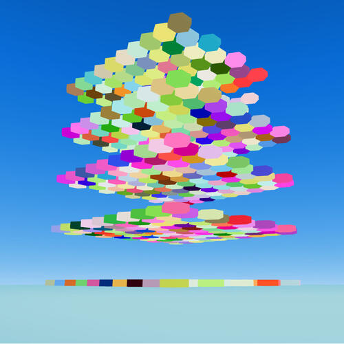

# Spleef



Stay in the game longer then all the other players. Each platform disappears shortly after you land on it. Jump platform to platform to avoid falling down the different levels, if you fall all the way through you will be eliminated.

## Getting Started

First, run the development server:

```bash
npm run dev
```

## Multiplayer

Aiming to have multiplayer via P2P and Websockets. Websocket backend code is not in this repo or available at this time. P2P code will be included here.

## Inspiration

Many games have implemented spleef like gamemodes within their content. The earliest examples go back to Tron 2.0 (2003) and Blockland (2003). Spleef was made mainstream as a gamemode inside the game Minecraft.

## Attributions
[Character Model](https://github.com/Articles-Joey/spleef)